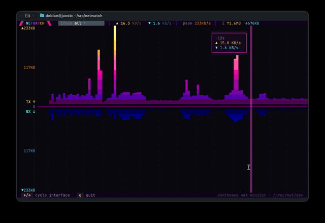

# `netwatch`

> **Network throughput as an 80s sunset.** A two-sided bar chart of live traffic over time — egress (TX) climbing up from a neon zero-axis, ingress (RX) falling down, newest sample on the right. One interface or all of them, sampled straight from the kernel's byte counters.

<p align="center">
  
  
  
  <a href="https://discord.gg/dYZu9PjKB"></a>
</p>



**`netwatch` turns the kernel's live interface stats into a retrowave dashboard: per-second egress and ingress for any interface, drawn as a mirrored, sub-cell-resolution bar chart that scrolls through time — with a clickable interface picker and a hover readout for the exact rate at any point on the axis.**

It's a **yeet** script — a reactive JSX TUI running in the daemon's V8 isolate, fed by the live system graph. No agents, no config, and no root for the dashboard itself: it reads the kernel's interface counters over yeet's unprivileged socket.

> [!TIP]
> **Counters, not rates.** The live stats the kernel exposes are *cumulative* byte counts, not rates. netwatch samples them on a fixed window and differences consecutive reads into the per-second rates you actually want — then keeps a rolling window of those samples so the chart scrolls through time. Widen the terminal and you get more history, not bigger bars.

## Quick start

```sh
curl -fsSL https://yeet.cx | sh
yeet run github:yeet-src/netwatch
```
[Manual install guide](https://yeet.cx/docs/manual-installation) | Linux only

That's it — netwatch enumerates your interfaces, selects the default route, and starts drawing. It's fully interactive:

| input | action |
| ----- | ------ |
| `←` / `→` &nbsp;·&nbsp; `h` / `l` &nbsp;·&nbsp; `[` / `]` | previous / next interface |
| mouse wheel | cycle interface |
| click the `iface ▾` chip | open the interface dropdown |
| hover **or** drag across the chart | read the exact ↑/↓ rate at that point in time |
| `q` / `Esc` | quit (`Esc` first closes the dropdown) |

The interface list is every non-loopback link plus an **`all`** aggregate that sums them.

## A 60-second primer on the mirror chart

The whole dashboard is one idea drawn well: a time series of `{up, down}` rate samples, rendered as a chart that mirrors around a zero-axis. A few details make it read cleanly:

**Sub-cell resolution.** Each column is a bar whose height is fractional. Full cells are `█`; the tip is drawn with an eighth-block (`▁▂▃▄▅▆▇`) so a bar of 3.4 cells looks like 3.4, not 3. The **ingress** side grows *downward*, which needs blocks that fill from the *top* — there's no such glyph set, so those tips are drawn with the reverse (fg/bg swap) trick, flipping a bottom-filled block into a top-filled one.

**A shared, auto-scaling y-axis.** Both halves scale to one joint peak over the visible window, so up and down are directly comparable and the gutter's `▲peak` / `▼peak` labels always frame the tallest bar.

**The sunset.** Cells are colored by their height into a vertical gradient — warm (purple → magenta → gold) for egress, cool (navy → cyan) for ingress — so tall bars glow toward their bright tips. That's the synthwave read.

**It stays smooth.** The grid depends only on the data signal, so it redraws about twice a second (the sample cadence) and never on pointer motion. The crosshair and the hover readout are separate lightweight overlays that read the pointer alone, and each row's cells are coalesced into a handful of color *runs* rather than one node per cell — so a full-width chart is cheap to paint and cheap to hover.

## Common use cases

- Watch a download or upload saturate a link in real time, with the two-sided shape showing send/receive at a glance.
- Tell bursty traffic from sustained traffic instantly — the time axis is right there.
- Compare load across interfaces: flip between `eth0`, a WireGuard/`wg0` tunnel, `docker0`, or the `all` aggregate without restarting.
- Keep a glanceable, always-on throughput monitor in a spare terminal or tmux pane.
- Scrub back through the on-screen history and read the exact rate at any moment with the hover crosshair.

## What you're looking at

```
 ◢◤ NETWATCH ◥◣   iface eth0 ▾    ▲ 1.2 MB/s   ▼ 8.4 MB/s    peak 9.1MB/s    Σ ↑182MB ↓1.4GB
 ▲9.1MB    ·       ·       ·       ·       ·       ·       ·       ·       █
      ┊    ·       ·       ·       ·       ·       ·       ·    ▁▃  ▂▄▆█████
 4.6MB     ·       ·       ·       ·    ▁▂ ▁▃▄▅▆▇████████████████████████████
   TX ↑ ▂▃▄▅▆▇████████████████████████████████████████████████████████████████
      0 ────────────────────────────────────────────────────────────────────────
   RX ↓ ████████████████████████████████████████████████████████████████████████
      ┊    ██████████████████████████████████████████████████████████████████████
 4.6MB     ·   ▇▆▅▃▁████████████████████████████▅▄▂  ▄▆████████████████████████
 ▼9.1MB    ·       ·       ·   ▇▅▃▁████████▂▄▆      ·       ·   ▇▆▅▃▁███████████
```

The **title rail** shows the selected interface, the current ↑/↓ rates, the window peak, and session totals (`Σ`). The **gutter** on the left labels the axis: peak at the edges, a half-scale tick in the middle, `TX ↑` / `RX ↓` beside the zero line. Egress fills the top, ingress the bottom, newest sample on the right; older samples scroll off to the left. Hovering (or dragging) lights a **crosshair** on that column and pops a readout of the exact `▲`/`▼` rate and how long ago the sample was.

The palette is a neon synthwave gradient (a 256-color ramp with truecolor accents). Rates use 1024-based units (`B/s`, `KB/s`, `MB/s`, `GB/s`).

## How it works

Three layers, composed in [`src/main.jsx`](src/main.jsx): a data probe exposes plain reactive signals, pure components read them, and a small helper library does the retrowave rendering math.

### The data side

[`src/probes/netstat.js`](src/probes/netstat.js) polls the yeet system graph on a fixed window (`SAMPLE_MS`, 500 ms) and turns cumulative counters into a live signal:

- One `yeet.graph.query` per tick reads `recv_bytes` / `sent_bytes` for every interface.
- Consecutive samples are differenced into per-second rates (`sent` = egress ↑, `recv` = ingress ↓); a rolling history per interface feeds the chart's time axis.
- A synthetic **`all`** interface sums every non-loopback link each tick.
- The producer is a `from(...)` signal, so the poll timer starts when the UI first watches it and stops when it doesn't.

### The UI side

| file | responsibility |
|---|---|
| [`src/main.jsx`](src/main.jsx) | composition root — input, responsive layout, the dropdown/scrim overlay |
| [`src/components/mirrorchart.jsx`](src/components/mirrorchart.jsx) | the two-sided chart, crosshair, and hover readout |
| [`src/components/titlebar.jsx`](src/components/titlebar.jsx) | brand, the clickable interface chip, live rates / peak / totals |
| [`src/components/ifacemenu.jsx`](src/components/ifacemenu.jsx) | the interface dropdown |
| [`src/components/footer.jsx`](src/components/footer.jsx) | key hints |
| [`src/lib/retro.js`](src/lib/retro.js) | palette, sunset gradients, block-glyph helpers, byte-rate formatting |
| [`src/lib/ui.js`](src/lib/ui.js) | shared view state (dropdown open, hovered column) |

The chart reads signals through **thunks** — `{() => …}` props and children — so a node re-renders exactly when a signal it read changes, and no more. That's what keeps hover off the grid's hot path.

### Why polling, and why it needs no privileges

Throughput is just the delta of two numbers the kernel already maintains, and yeet's system graph exposes them directly. So netwatch simply reads those counters over yeet's unprivileged socket on a timer and does the arithmetic in JS — nothing to load, no elevated privileges, no root.

## Alerting

The feed is on your screen — but the same poll tick that computes each interface's rate can also *page you*. yeet posts to Slack: log in at [yeet.cx/settings](https://yeet.cx/settings), connect your workspace once, and `yeet.alert` can then send to any channel it can reach.

The tick in `netstat.js` already has every interface's up/down rate in hand, so a threshold alert is a branch inside it:

```js
const ALERT_BPS = 900 * 1024 * 1024 / 8; // page above ~900 Mbps

// inside the poll tick, after computing this interface's rates:
if (up + down > ALERT_BPS) {
  await yeet.alert({
    method: "slack",
    channel: "#alerts",
    text: `netwatch: ${name} at ↑${fmtRate(up)} ↓${fmtRate(down)}`,
    blocks: [
      { type: "header", text: { type: "plain_text", text: "Link saturated" } },
      { type: "section", fields: [
        { type: "mrkdwn", text: `*Interface:*\n${name}` },
        { type: "mrkdwn", text: `*Throughput:*\n↑${fmtRate(up)}  ↓${fmtRate(down)}` },
      ]},
    ],
  });
}
```

The same shape fits any trigger: a sudden jump over a baseline, an interface that should be idle lighting up, or the `all` aggregate crossing your uplink's rated ceiling.

## Requirements

> [!IMPORTANT]
> The yeet daemon, which serves the system graph. `curl -fsSL https://yeet.cx | sh` installs it.
>
> Linux. **No root needed** — it reads interface counters over yeet's unprivileged socket.

## Honest caveats

> [!NOTE]
> netwatch is a monitor, not a meter. It's a live, at-a-glance view — not a billing-grade accounting tool.

- Rates are averaged over the sample window (500 ms), so a sub-window spike is smoothed, not resolved.
- The **`all`** aggregate sums every non-loopback interface, so traffic that crosses both a virtual link (veth/bridge/`docker0`) and a physical NIC is counted on each — the aggregate can read high for container or forwarded traffic. Pick a specific interface for an exact figure.
- It reads byte counters, not packets or flows — there's no per-connection or per-process breakdown. ([contact us](https://yeet.cx/?utm_source=github&utm_medium=readme&utm_campaign=netwatch&utm_content=caveats-flows) for per-flow yeet scripts.)
- The y-axis auto-scales to the visible window and is shared across both halves, so the peak label moves as traffic changes — there is no fixed scale.

## Community questions

**Why not `nload` / `iftop` / `bmon`?**
Use them if they fit. netwatch is a yeet script: a hackable JS/JSX TUI you can restyle, re-scale, or wire to alerting and export in a few lines — and it looks like a Kavinsky album. The classics are great single-purpose binaries; this is a programmable dashboard.

**Does it need root?**
No. It reads the system graph over yeet's unprivileged socket — nothing privileged to load.

**Which interfaces does it show?**
Every non-loopback link, plus an `all` aggregate. It selects your default-route interface on start; cycle with the arrows, wheel, or the dropdown.

**Can I change the refresh rate or the colors?**
Yes. `SAMPLE_MS` in `src/probes/netstat.js` sets the poll/scroll cadence; the palette and gradients live in `src/lib/retro.js`.

**Can I export the stream?**
Not built in today. The poll tick in `src/probes/netstat.js` is where you'd add a sink — the same place as the Slack alerting example — for JSON over HTTP, a metrics endpoint, or a SIEM. To set up a managed export pipeline, [contact us](https://yeet.cx/?utm_source=github&utm_medium=readme&utm_campaign=netwatch&utm_content=faq-export).

## Building / running from source

```sh
make          # bundles src/main.jsx -> src/index.jsx with esbuild
yeet run .    # run the local bundle
```

The build needs no npm, node, or C toolchain — the only step is yeet's vendored esbuild resolving the `@/` alias and bundling the JSX. netwatch is pure JS, so `make` pulls just the bundler.

## License

GPL-2.0, consistent with the yeet-src project family.

---

Built with [yeet](https://yeet.cx/docs/?utm_source=github&utm_medium=readme&utm_campaign=netwatch), a JS runtime for building live kernel-powered tools on Linux. Join us on [discord](https://discord.gg/dYZu9PjKB?utm_source=github&utm_medium=readme&utm_campaign=netwatch).
